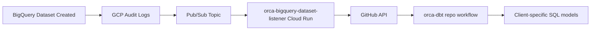

# BigQuery Dataset Listener

## Quick Mental Model

This is an **event-driven microservice** that:
1. Listens for BigQuery dataset creation events (via Pub/Sub push)
2. Parses the dataset name using a strict `parent__client` naming convention
3. Looks up templates in an internal catalog based on the `parent` (e.g., `shopify`, `facebook_ads`)
4. Waits until the raw tables those templates read exist in BigQuery (the connector's first sync creates them after the dataset)
5. Dispatches a GitHub repository event to `ORCA-Analytics/orca-dbt` with file creation instructions
6. The dbt repo workflow then generates client-specific SQL files from templates

**Think of it as:** _Infrastructure-as-code event handler that automates dbt model scaffolding when new client datasets appear in BigQuery._

## What This Repo Does

This Cloud Run service receives BigQuery audit log events (specifically dataset creation events) via Pub/Sub, extracts the dataset ID, matches it against a hardcoded catalog of known data source patterns (Shopify, Facebook Ads, Google Analytics, etc.), and triggers a GitHub repository dispatch to the `orca-dbt` repo. The dbt repo's GitHub Actions workflow then creates SQL model files from templates for the new client dataset. This eliminates manual file creation when onboarding new clients.

## Tech Stack

| Layer | Technology |
|---|---|
| Language | Node.js 22 (CommonJS) |
| Framework | Express 4.x |
| Key dependencies | `express`, `@google-cloud/bigquery` (table checks) |
| Database(s) | None (stateless service) |
| Deploys to | Google Cloud Run (`us-central1`) |
| CI/CD | Google Cloud Build (docker build → push → deploy) |

## How to Run Locally

```bash
# Prerequisites
# - Node.js 22+ (matches Dockerfile base)
# - GITHUB_TOKEN env var with repo:dispatch scope

# Install
npm install

# Run
GITHUB_TOKEN=ghp_your_token_here node server.js

# Test health endpoint
curl http://localhost:8080/healthz
```

### Required Environment Variables

| Variable | Purpose | Where to find the value |
|---|---|---|
| `GITHUB_TOKEN` | GitHub API token for repository dispatch to `orca-dbt` | Google Cloud Secret Manager (prod) or generate personal token with `repo` scope (local dev) |
| `PORT` | HTTP server port (optional, defaults to `8080`) | Auto-set by Cloud Run, can override locally |
| `MAX_WAIT_HOURS` | How long to wait for a new dataset's tables before dispatching anyway (optional, defaults to `72`) | Cloud Run service env var |

The Cloud Run runtime service account needs `roles/bigquery.metadataViewer` on `orcaanalytics` to list tables (see Deployment). Without it the listener logs `TABLE_CHECK_FAILED` and dispatches immediately, as it did before table checks existed.

## Folder Structure

```
orca-bigquery-dataset-listener/
├── server.js              # All application logic (routes, catalog, table checks, dispatch)
├── test/server.test.js    # Handler tests (node --test), fake BigQuery client
├── package.json           # Dependencies: express, @google-cloud/bigquery
├── Dockerfile             # Node 20 Alpine container
├── cloudbuild.yaml        # GCP deployment pipeline config
├── .dockerignore          # Build exclusions
└── .gitignore             # Git exclusions
```

### Key Entry Points

- **Main entry:** `server.js` (lines 1-217) - entire application in one file
- **Core logic:**
  - `splitDataset()` - parses dataset ID into `parent` and `client` parts
  - `buildPlan()` - matches dataset against catalog and generates file plan, plus the tables to wait for
  - `findMissingTables()` - lists which of those tables don't exist yet
  - `dispatchToGitHub()` - sends repository dispatch event
- **API routes:**
  - `GET /healthz` - health check (returns `200 ok`)
  - `POST /` - Pub/Sub push endpoint (receives base64-encoded audit log events)

## How It Relates to Other ORCA Services


```mermaid
flowchart LR
    BQDataset[BigQuery Dataset Created] --> AuditLog[GCP Audit Logs]
    AuditLog --> PubSub[Pub/Sub Topic]
    PubSub --> Listener[orca-bigquery-dataset-listener Cloud Run]
    Listener --> GitHubAPI[GitHub API]
    GitHubAPI --> DBTRepo[orca-dbt repo workflow]
    DBTRepo --> NewFiles[Client-specific SQL models]
```

- **Reads from:** Pub/Sub push messages containing BigQuery audit log entries (`protoPayload.resourceName`, `timestamp`), and BigQuery table listings for the datasets a scaffold reads
- **Writes to:** GitHub API (`/repos/ORCA-Analytics/orca-dbt/dispatches` endpoint)
- **Triggered by:** GCP Pub/Sub push subscription (configured external to this repo)
- **Depended on by:** `orca-dbt` repo GitHub Actions workflow expects `bq_dataset_created` event type with specific payload structure

**Assumptions (not verified in code):**
- Pub/Sub subscription and BigQuery audit log sink are configured in GCP console
- `orca-dbt` repo has a `.github/workflows/*.yml` listening for `repository_dispatch` events with type `bq_dataset_created`

## Conventions

### Naming

- **Files:** All lowercase, underscore-separated (e.g., `server.js`)
- **Variables/Functions:** camelCase (e.g., `buildPlan`, `datasetId`)
- **Constants:** SCREAMING_SNAKE_CASE (e.g., `GITHUB_TOKEN`, `GH_OWNER`)
- **Dataset IDs:** `parent__client` format (e.g., `shopify__acmecorp`, `facebook_ads__clientxyz`)
  - Pattern: `/^([a-z0-9_]+)__([a-z0-9_]+)$/`
  - Double underscore is required separator
- **Branches:** Git log shows `update/description`, `fix/description`, `bug/description` patterns

### Code Patterns

- **Single-file service:** All logic in `server.js` (no modules/imports beyond Express)
- **Catalog-driven logic:** `CATALOG` object maps parent dataset names to template entries. Each entry's `tables` lists the raw tables its orca-dbt template reads (`dataset.table`, with `{client}` filled in), which the listener waits for
- **Waiting via Pub/Sub redelivery:** while tables are missing (and the dataset is younger than `MAX_WAIT_HOURS`), the handler returns 429, so Pub/Sub redelivers the message later; no state is stored. After the max wait it dispatches anyway and includes `missingTables` in the payload
- **Custom output functions:** Some catalog entries use `out: (tpl, client) => filename` for non-standard naming
- **Graceful skips:** Returns HTTP 204 (no content) when dataset doesn't match catalog (not an error)
- **Error handling:** Try/catch on main handler, logs to stdout, returns 500 on dispatch failures

### Testing

- **Framework:** Node's built-in test runner (`node:test`), no dev dependencies
- **Where tests live:** `test/server.test.js` (drives the HTTP handler with Pub/Sub-shaped messages and a fake BigQuery client)
- **How to run:** `npm test`

## Gotchas

> **If you're an AI agent and you're about to change something in this repo, read this section first.**

### Things That Look Wrong but Are Intentional

- **Hardcoded constants in code:** `GH_OWNER`, `GH_REPO`, `PROJECT` are intentionally hardcoded (not env vars) because they're ORCA infrastructure constants
- **Global fetch:** Uses Node 18+ native `fetch` (no `node-fetch` import needed) - see commit `58092e6`
- **204 responses for non-matches:** Returning 204 instead of 404/400 when dataset doesn't match catalog is intentional (Pub/Sub retries on errors)
- **429 responses while waiting:** Expected. A 429 means "tables not there yet"; Pub/Sub redelivers on the subscription's retry policy. Look for `WAITING_FOR_TABLES` log lines
- **Service name:** the Cloud Run service is `orca-bigquery-dataset-listener`. `_SERVICE` in `cloudbuild.yaml` must match it, or a manual `gcloud builds submit` deploys a second, separate service
- **Dispatching when the table check fails:** Intentional fail-open, so a missing permission or BigQuery outage never blocks scaffolding (logged as `TABLE_CHECK_FAILED`)

### Fragile Areas

- **CATALOG object accuracy:** If template paths or folder structures change in `orca-dbt`, this catalog becomes stale. No automated validation.
- **`tables` lists:** If an orca-dbt template starts reading a new raw table, add it to that entry's `tables`. A table that's listed but never synced (e.g. a store without `customer_journey_summary`) delays that platform's scaffold until `MAX_WAIT_HOURS`, then it dispatches with `missingTables` set
- **Pub/Sub subscription settings (outside this repo):** the wait relies on the subscription's retry policy and retention. A dead-letter policy caps deliveries (max 100), which can end the wait early; see Deployment
- **Dataset naming regex:** `splitDataset()` regex is strict - any variation (single underscore, triple underscore, uppercase) silently fails matching
- **Directory aliases:** Some parents use `dir` override (e.g., `fairing` uses `hdyhau_fairing` directory) - easy to miss when adding new entries
- **Custom output functions:** Entries with `out: (tpl, client) => ...` override standard naming - must be maintained manually
- **GitHub token scope:** Must have `repo` scope for private repo dispatch, will fail silently with 404 if token lacks permissions

### Known Tech Debt

- **Catalog is embedded in code:** Template catalog should ideally live in `orca-dbt` repo as source of truth (single source)
- **No validation on dispatch success:** GitHub dispatch returns 204 regardless of whether workflow exists/runs
- **No structured logging:** Uses `console.log` instead of structured logging (Cloud Logging compatibility could be better)
- **No retry logic:** If GitHub API is temporarily down, message is lost (Pub/Sub will retry the POST, but within deadline)

### Environment-Specific Quirks

- **Local vs Cloud Run:** `PORT` defaults to 8080 locally, but Cloud Run injects its own port via env var
- **Token authentication:** Production uses Secret Manager injection, local dev requires manual export
- **No Pub/Sub emulator pattern:** Testing requires actual Pub/Sub or manual curl with base64-encoded payloads

## Deployment

### One-time GCP setup for table checks

Do these before merging the table-check change (merging deploys). If the code deploys first, it fails open and dispatches immediately, as before.

```bash
# 1. Let the Cloud Run service list BigQuery tables
SA=$(gcloud run services describe orca-bigquery-dataset-listener --region us-central1 \
  --format='value(spec.template.spec.serviceAccountName)')
# (empty = the default compute service account, <PROJECT_NUMBER>-compute@developer.gserviceaccount.com)
gcloud projects add-iam-policy-binding orcaanalytics \
  --member="serviceAccount:$SA" --role="roles/bigquery.metadataViewer"

# 2. Find the push subscription that targets this service
gcloud pubsub subscriptions list --format='table(name, pushConfig.pushEndpoint)'

# 3. Redeliver waiting messages every 1-10 minutes instead of as fast as possible
gcloud pubsub subscriptions update SUBSCRIPTION --min-retry-delay=60s --max-retry-delay=600s

# 4. Check retention and dead-lettering
gcloud pubsub subscriptions describe SUBSCRIPTION \
  --format='yaml(messageRetentionDuration, deadLetterPolicy)'
```

Retention must exceed `MAX_WAIT_HOURS` (the 7-day default does). A dead-letter policy stops redelivery after `maxDeliveryAttempts` (at most 100, roughly 16 hours at a 10-minute retry delay): either remove it or set `MAX_WAIT_HOURS` below that.

### How to Deploy

**Automated (recommended):**
1. Push to `main` branch or merge PR
2. Cloud Build trigger automatically runs `cloudbuild.yaml`
3. Steps:
   - Builds Docker image tagged with `$SHORT_SHA`
   - Pushes to Artifact Registry (`us-central1-docker.pkg.dev/.../listeners/orca-bigquery-dataset-listener`)
   - Deploys to Cloud Run service `orca-bigquery-dataset-listener` in `us-central1`
   - Service requires authentication (`--no-allow-unauthenticated`)

**Manual:**
```bash
gcloud builds submit --config cloudbuild.yaml
```

### How to Roll Back

Cloud Run keeps previous revisions:

```bash
# List revisions
gcloud run revisions list --service=orca-bigquery-dataset-listener --region=us-central1

# Route 100% traffic to previous revision
gcloud run services update-traffic orca-bigquery-dataset-listener \
  --region=us-central1 \
  --to-revisions=PREVIOUS_REVISION_NAME=100
```

## Key Code References

**Dataset parsing logic:**
```javascript
// server.js lines 13-16
function splitDataset(datasetId) {
  const m = datasetId.match(/^([a-z0-9_]+)__([a-z0-9_]+)$/);
  return m ? { parent: m[1], client: m[2] } : null;
}
```

**GitHub dispatch payload structure:**
```javascript
// server.js lines 201-205
await dispatchToGitHub({
  datasetId,           // e.g., "shopify__acmecorp"
  files: plan.files,   // Array of {template: "path", path: "output/path"}
  vars: plan.vars,     // {datasetId, parent, client, project}
});
```

<!-- STATUS: needs-review -->